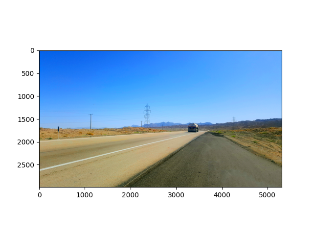
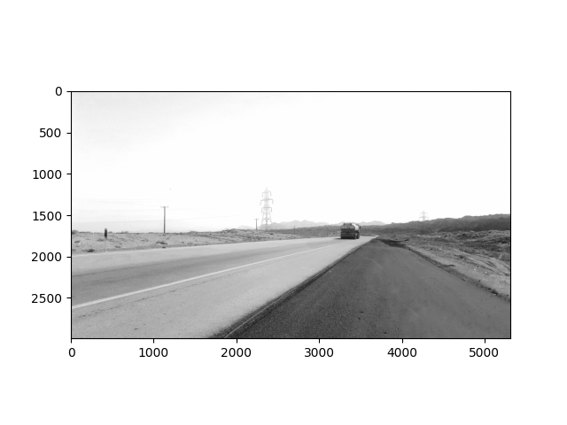

# create-black-and-white-images-by-python
every pixle in *.JPG* frmat has 3 component: R(red), G(green), B(blue), in PNG there is another component determines transparency(we dont need this).the values of component are in range 0-1.
when all component has same value, the image will be black and white, for example (R:0.5, G:0.5 B:0.5).
the script reads pixels of image and put three component of every pixels to the minimum (or maximum) value between them.
.
input image:

.
output image:

